# Cheese MVC Persistent (deprecated)
A web application for creating and managing cheese menus. Read below for
an image based demonstration of the application.

*This application was for an assignment at LaunchCode's Lc101 2018*

## Technologies
* Java
* Spring-Boot
* MySQL
* Thymeleaf
* HTML
* CSS

# Demonstration

## Home screen (before adding data)
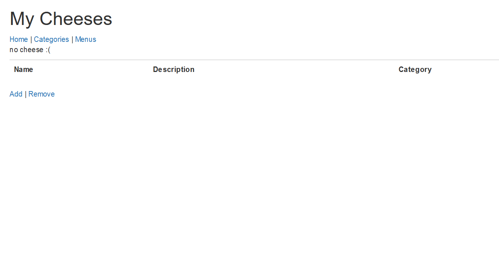

## Categories page (before adding data)
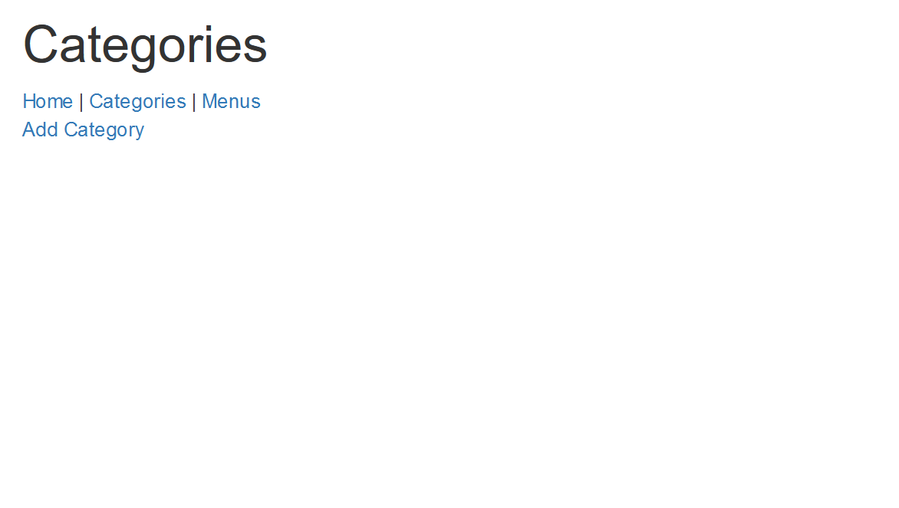

## Menus page (before adding data)

## Form for adding category
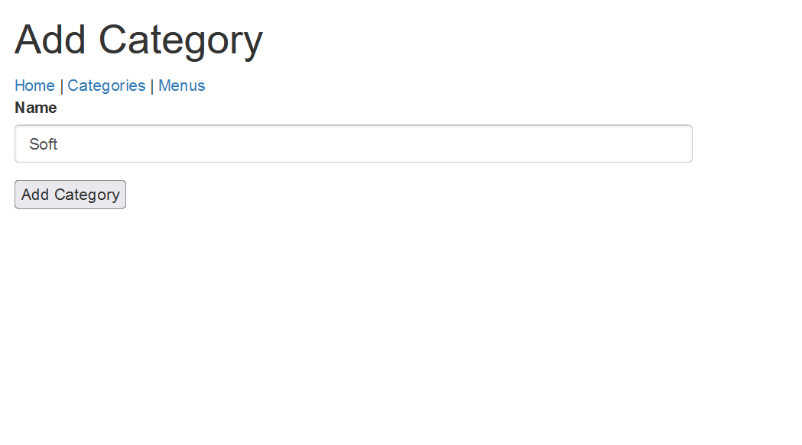

## After adding first category
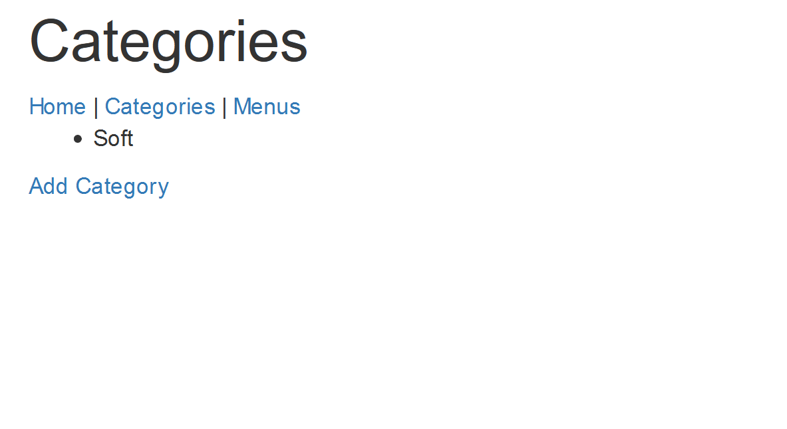

## After adding numerous categories
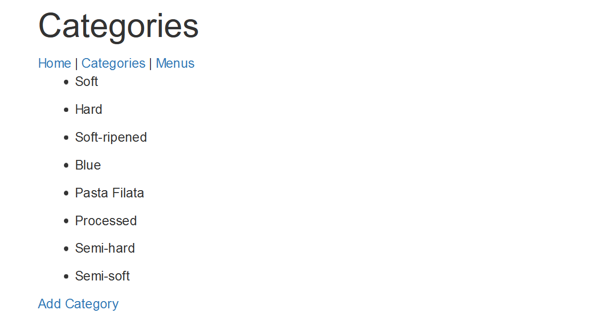

## Add menu form
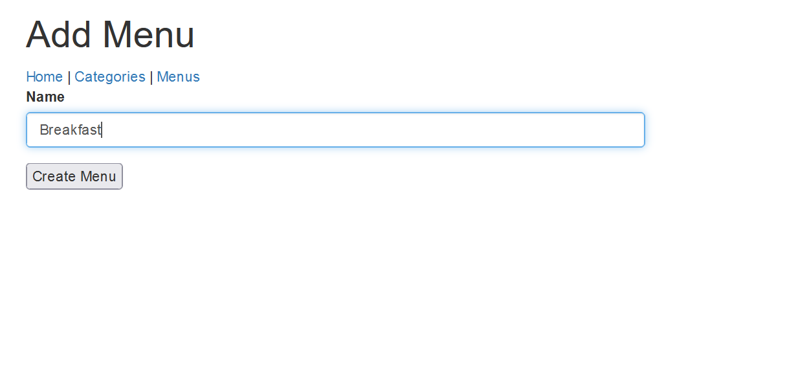

## After creating new menu (Breakfast w/o associated cheese(s))
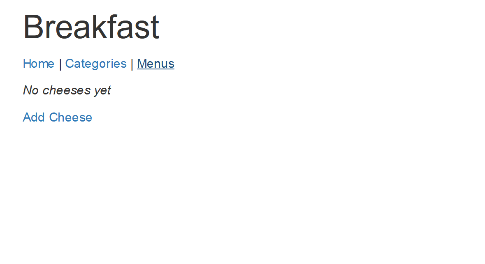

## Menus page (after creating multiple menus)
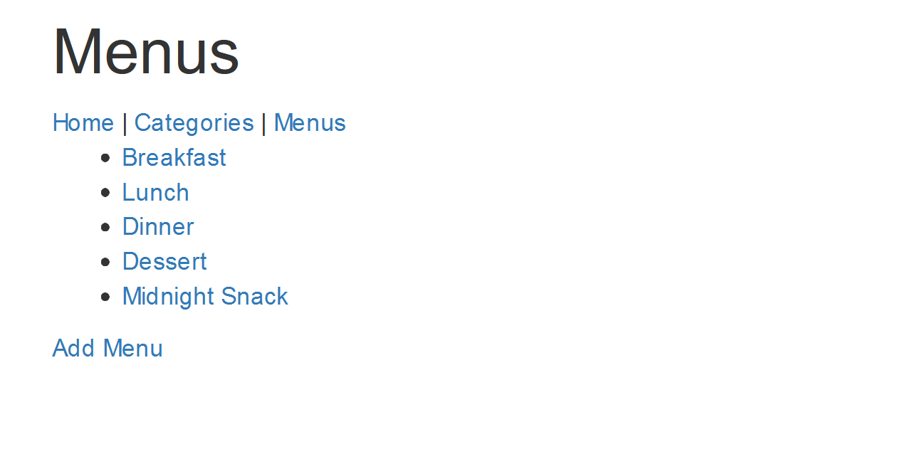

## Add cheese form
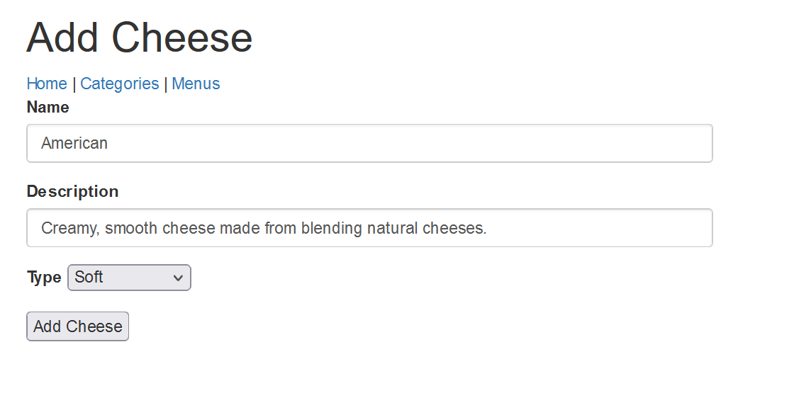

## Home screen after adding first cheese
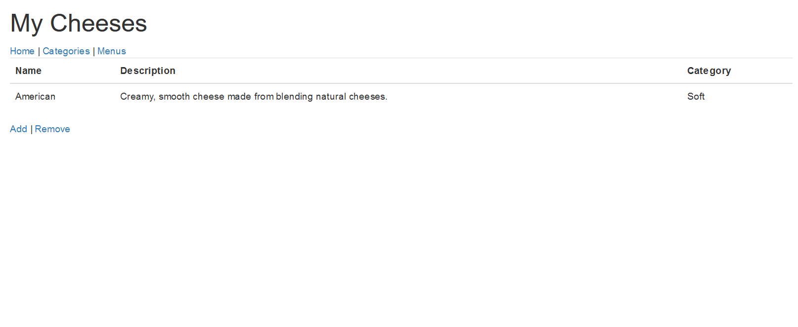

## Home screen after adding multiple cheeses
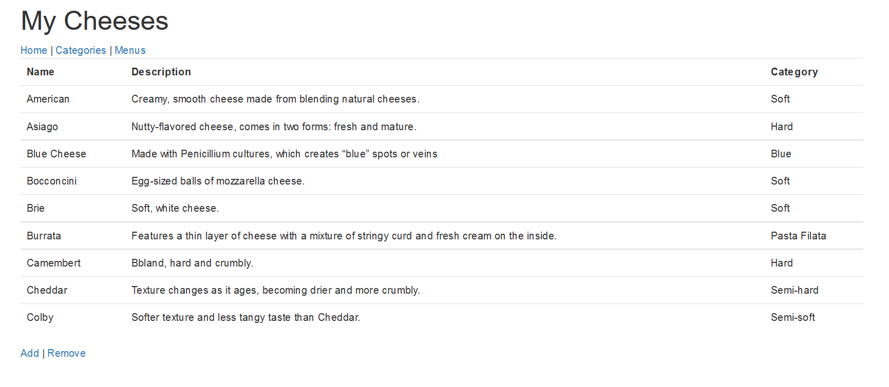

## Form for adding cheese to menu (Dessert menu)
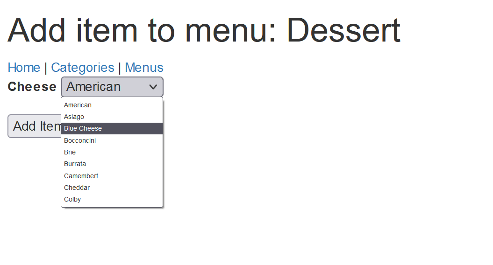

## After adding numerous cheeses to dessert menu
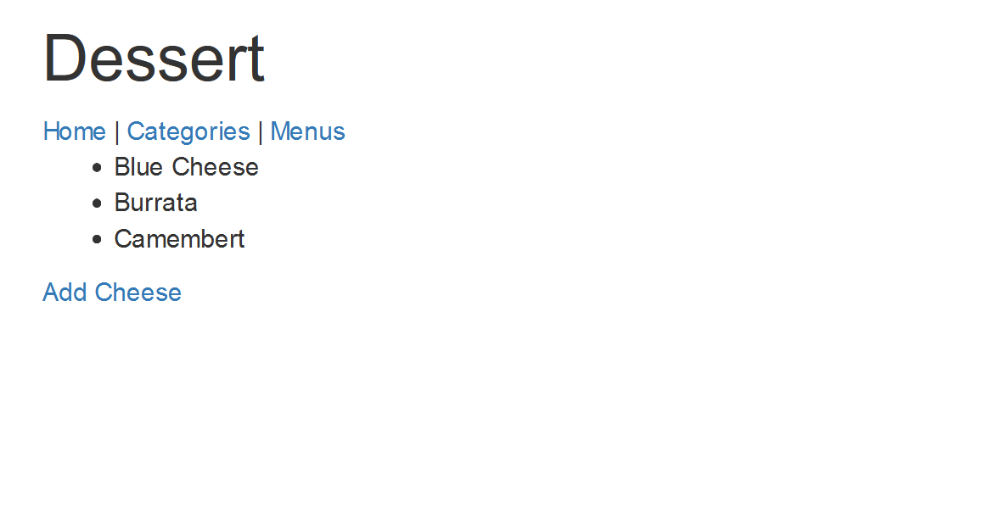

## Form for deleting cheeses from database (functionality coming in future improvement)
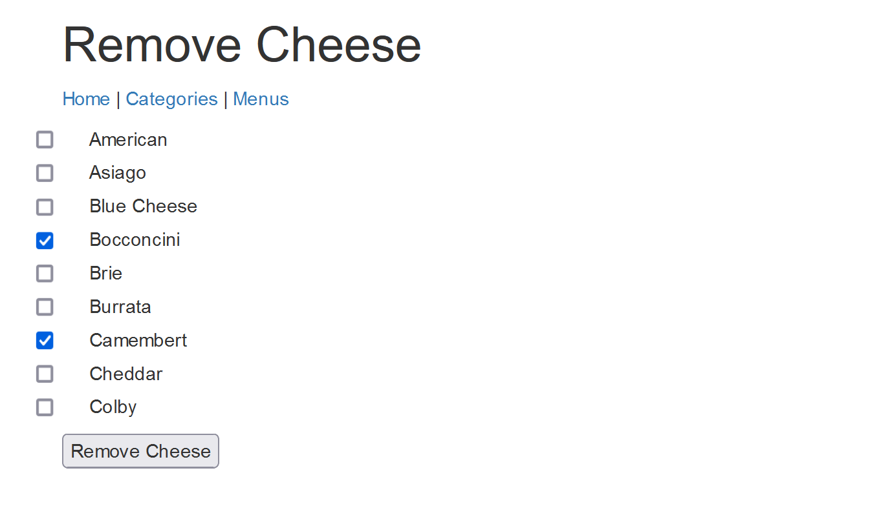
